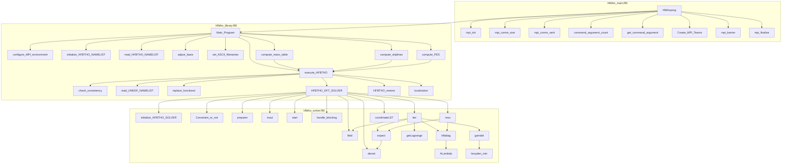

# HFBTHO 计算总流程

本文档汇总 HFBTHO 各源码模块的主要物理公式与核心函数调用关系。

---

## 主要公式

### `hfbtho_main.f90`

无

### `hfbtho_library.f90`

#### `execute_HFBTHO` — 四极矩与形变转换

$$
Q_{20} = \beta \, \sqrt{\frac{5}{\pi}} \, \frac{A^{5/3}}{100}, \qquad A = Z + N
$$

#### `compute_driplines` — 双核子分离能（滴线判据）

$$
S_{2N} = E(N-2, Z) - E(N, Z)
$$

$$
S_{2Z} = E(N, Z-2) - E(N, Z)
$$

### `hfbtho_solver.f90`

#### `preparer` — 谐振子基组参数

$$
q = \exp\!\left(3\sqrt{\frac{5}{16\pi}} \, \beta_0\right), \quad b_\perp = b_0 \, q^{-1/6}, \quad b_z = b_0 \, q^{1/3}
$$

若 $b_0 \le 0$，采用经验公式：

$$
\hbar\omega = 41 \, A^{-1/3} \, r_0 \; [\mathrm{MeV}], \qquad b_0 = \sqrt{\frac{2\hbar^2}{m\hbar\omega}}
$$

质心系修正（若启用）：

$$
hb0 = hbzero \cdot \left(1 - \frac{1}{A}\right)
$$

#### `start` — Woods-Saxon 初始势

$$
V_{WS}(r) = \frac{V_0}{1 + \exp\!\bigl((r - R_{WS})/a\bigr)}
$$

$$
V_{LS}(r) = -\frac{\hbar^2}{2m^2c^2}\frac{V_0 \kappa_{so}}{r}\frac{d}{dr}\frac{1}{1 + \exp\!\bigl((r - R_{so})/a_{so}\bigr)}
$$

核表面多极展开：

$$
R(\theta) = R_0 \, c(\beta) \left[1 + \sum_{\lambda=1}^{4} \beta_\lambda \, Y_{\lambda 0}(\theta)\right]
$$

#### `hfbdiag` — HFB 准粒子方程

$$
\mathcal{H}_{HFB} = \begin{pmatrix} h - \lambda & \Delta \\ \Delta^\dagger & -(h - \lambda) \end{pmatrix}
$$

密度矩阵与配对张量：

$$
\rho_{ab} = \sum_k V_{ak} V_{bk}^*, \qquad \kappa_{ab} = \sum_k U_{ak} V_{bk}^*
$$

温度 Fermi-Dirac 占据数：

$$
f_T(E_k) = \frac{1}{2}\left(1 - \tanh\frac{E_k}{2T}\right)
$$

#### `ALambda` — 化学势搜索（粒子数守恒）

$$
N(\lambda) = \sum_{k=1}^{kl} 2v_k^2(\lambda) = N_{target}
$$

$$
v_k^2 = \frac{1}{2}\left(1 - \frac{e_k - \lambda}{\sqrt{(e_k - \lambda)^2 + \Delta_k^2}}\right)
$$

#### `densit` — 坐标空间密度

$$
\rho(\boldsymbol{r}) = \sum_k \left[(1-f_T)|\phi_k^{(V)}|^2 + f_T|\phi_k^{(U)}|^2\right]
$$

$$
\tau(\boldsymbol{r}) = \sum_k \left[(1-f_T)|\nabla\phi_k^{(V)}|^2 + f_T|\nabla\phi_k^{(U)}|^2\right]
$$

$$
\kappa(\boldsymbol{r}) = \sum_k \phi_k^{(U)*} \phi_k^{(V)}
$$

其中 $f_T(E_k) = \frac{1}{2}\left(1 - \tanh\frac{E_k}{2T}\right)$ 为准粒子热占据数。

#### `field` — 平均场与配对场

配对场（delta 配对）：

$$
\Delta_n(\boldsymbol{r}) = V_0^{(n)}\left(1 - \eta_n \frac{\rho}{\rho_c}\right) \kappa_n(\boldsymbol{r})
$$

配对正规化（适用于 $\lambda > pUr$ 且 $pUr + ec - \lambda < 0$）：

$$
\Delta_n = \frac{\kappa_n}{g_{eff}^{-1}}, \qquad g_{eff}^{-1} = \frac{1}{g} - \frac{1}{4\pi^2}\left(\frac{k_c}{m^*} - \frac{k_F}{2m^*}\ln\frac{k_c+k_F}{k_c-k_F}\right)
$$

其中 $k_c = \sqrt{2m^*(\lambda + E_c - U)}$，$k_F = \sqrt{2m^*(\lambda - U)}$。

#### `gamdel` — 组态空间 HFB 矩阵元

$$
h_{ab} = \int d^3r \, \varphi_a^*(\boldsymbol{r}) \left[-\frac{\hbar^2}{2m^*}\nabla^2 + U(\boldsymbol{r})\right] \varphi_b(\boldsymbol{r})
$$

$$
\Delta_{ab} = \int d^3r \, \varphi_a^*(\boldsymbol{r}) \, \Delta(\boldsymbol{r}) \, \varphi_b(\boldsymbol{r})
$$

#### `broyden_min` — Broyden 混合加速收敛

$$
v_{in}^{(n+1)} = v_{in}^{(n)} + G^{(n)} f^{(n)}, \qquad f^{(n)} = v_{out}^{(n)} - v_{in}^{(n)}
$$

#### `expect` — 总能量分解

$$
E_{tot} = E_{kin} + E_{vol} + E_{surf} + E_{so} + E_{Coul} + E_{pair} + E_{tens} + E_{extra} + E_{ext}
$$

配对能：

$$
E_{pair} = \int d^3r \, \Delta(\boldsymbol{r}) \, \kappa(\boldsymbol{r})
$$

#### `getLagrange` — 约束 Lagrange 乘子更新

约束关联矩阵（极化率）：

$$
M_{ij} = \sum_{kl} \frac{\tilde{F}_i^{12}(k,l) \, \tilde{F}_j^{12}(k,l)}{E_k + E_l}
$$

Lagrange 乘子更新：

$$
\lambda_i^{new} = \lambda_i^{old} + \sum_j (M^{-1})_{ij} \left(Q_j^{requested} - Q_j^{current}\right)
$$

---

## 总流程调用关系

---

> 待续：后续将按执行顺序继续展开 `HFBTHO_restore`、`localization` 等下游模块。
