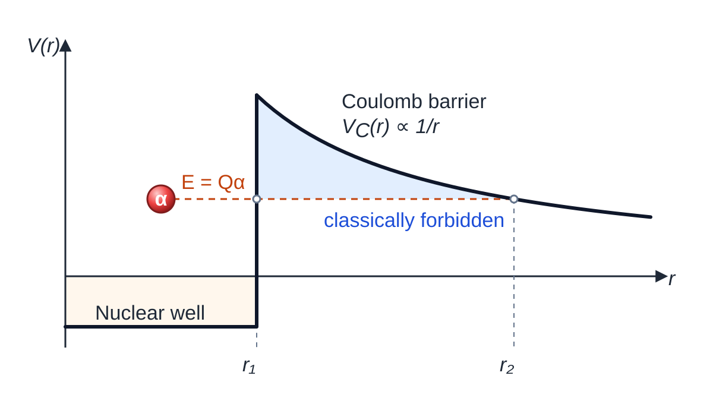

# Alpha Decay

### Main Theoretical Approaches

Theoretical descriptions of $\alpha$ decay include:

- Static approaches

  - Wentzel–Kramers–Brillouin (WKB) approximation
  - $R$-matrix theory
  - Three-body reaction models
  - ...

- Time-dependent approaches

  - WSM time-evolution formalism
  - Grigorenko Green-function method
  - Hagino Green-function method
  - Casal time-evolution method
  - ...

### Relativistic Kinematics

Let $P$, $D$, and $\alpha$ denote the parent nucleus, daughter nucleus, and $\alpha$ particle, with masses $M_P$, $M_D$, and $M_\alpha$. Let $E_D$ and $E_\alpha$ denote the final-state energies, and define the kinetic energies by $T_D=E_D-M_Dc^2$ and $T_\alpha=E_\alpha-M_\alpha c^2$.

The decay process is

$$
P\rightarrow D+\alpha.
$$

The decay energy is

$$
Q_\alpha=(M_P-M_D-M_\alpha)c^2=T_D+T_\alpha.
$$

Four-momentum conservation and the on-shell condition are

$$
p_P^\mu=p_D^\mu+p_\alpha^\mu,\qquad p^\mu=(E,\mathbf p c),\qquad p^\mu p_\mu=E^2-\mathbf p^2c^2=M^2c^4.
$$

In the parent-nucleus rest frame, $p_P^\mu=(M_Pc^2,\mathbf 0)$. The daughter-nucleus on-shell condition gives

$$
M_D^2c^4=p_D^\mu p_{D\mu}=(p_P-p_\alpha)^2=M_P^2c^4+M_\alpha^2c^4-2M_Pc^2E_\alpha.
$$

Therefore, the $\alpha$-particle energy is

$$
E_\alpha=\frac{M_P^2+M_\alpha^2-M_D^2}{2M_P}c^2.
$$

Its kinetic energy is

$$
T_\alpha=E_\alpha-M_\alpha c^2=\frac{(M_P-M_\alpha)^2-M_D^2}{2M_P}c^2.
$$

Using $M_P=M_D+M_\alpha+Q_\alpha/c^2$ and $Q_\alpha\ll M_Dc^2$,

$$
\boxed{T_\alpha=\frac{Q_\alpha(Q_\alpha+2M_Dc^2)}{2\left[Q_\alpha+(M_D+M_\alpha)c^2\right]}\simeq\frac{M_D}{M_D+M_\alpha}Q_\alpha}.
$$

### Nonrelativistic Kinematics

In the parent-nucleus rest frame, momentum conservation gives

$$
\mathbf p_P=\mathbf p_D+\mathbf p_\alpha=\mathbf 0,\qquad \mathbf p_D^2=\mathbf p_\alpha^2.
$$

The nonrelativistic kinetic energies are

$$
T_D=\frac{\mathbf p_D^2}{2M_D},\qquad T_\alpha=\frac{\mathbf p_\alpha^2}{2M_\alpha}\qquad\Rightarrow\qquad T_DM_D=T_\alpha M_\alpha.
$$

Since the decay energy becomes the total final-state kinetic energy,

$$
Q_\alpha=T_D+T_\alpha,
$$

the energy distribution is

$$
\boxed{T_\alpha=\frac{M_D}{M_D+M_\alpha}Q_\alpha,\qquad T_D=\frac{M_\alpha}{M_D+M_\alpha}Q_\alpha}.
$$

### WKB Approximation

Only the application of the WKB approximation to $\alpha$ decay is given here. Its general derivation is deferred to quantum mechanics.

Let $M_\alpha$ be the $\alpha$-particle mass, $Z_D$ the daughter-nucleus charge number, $e$ the elementary charge, and $\epsilon_0$ the vacuum permittivity. The Coulomb potential is

$$
V(r)=\frac{1}{4\pi\epsilon_0}\frac{2Z_De^2}{r}.
$$

Let $E$ be the emitted $\alpha$-particle kinetic energy. The inner and outer classical turning points are $r_1$ and $r_2$, with

$$
E=V(r_2)=\frac{1}{4\pi\epsilon_0}\frac{2Z_De^2}{r_2}.
$$

The WKB tunneling probability is proportional to $e^{-2\gamma}$, where

$$
\gamma=\frac{1}{\hbar}\int_{r_1}^{r_2}\sqrt{2M_\alpha[V(r)-E]}\,dr.
$$

For the Coulomb potential,

$$
\gamma=\frac{\sqrt{2M_\alpha E}}{\hbar}\left[r_2\left(\frac{\pi}{2}-\sin^{-1}\sqrt{\frac{r_1}{r_2}}\right)-\sqrt{r_1(r_2-r_1)}\right].
$$

For $r_2\gg r_1$,

$$
\gamma\simeq\frac{\sqrt{2M_\alpha E}}{\hbar}\left(\frac{\pi}{2}r_2-2\sqrt{r_1r_2}\right)=K_1\frac{Z_D}{\sqrt E}-K_2\sqrt{Z_Dr_1}.
$$

where

$$
K_1\equiv\left(\frac{e^2}{4\pi\epsilon_0}\right)\frac{\pi\sqrt{2M_\alpha}}{\hbar}=1.980\,\mathrm{MeV}^{1/2},
$$

$$
K_2\equiv\left(\frac{e^2}{4\pi\epsilon_0}\right)^{1/2}\frac{4\sqrt{M_\alpha}}{\hbar}=1.485\,\mathrm{fm}^{-1/2}.
$$

Let $R$ be the nuclear radius, $v_{\mathrm{in}}$ the internal $\alpha$-particle speed, and $\nu$ the assault frequency. The decay constant and half-life are

$$
\nu=\frac{v_{\mathrm{in}}}{R},\qquad \lambda_\alpha=\nu e^{-2\gamma},\qquad T_{1/2}^{\alpha}=\frac{\ln2}{\lambda_\alpha}.
$$

Let $a$ and $b$ denote constants for a fixed isotopic chain. For $E\simeq Q_\alpha$,

$$
\boxed{\ln T_{1/2}^{\alpha}=\ln\left(\frac{R\ln2}{v_{\mathrm{in}}}\right)+2K_1\frac{Z_D}{\sqrt E}-2K_2\sqrt{Z_Dr_1}=a+\frac{b}{\sqrt{Q_\alpha}}}.
$$

For relative orbital angular momentum $l$, let $A_D$ be the daughter-nucleus mass number and $u$ the atomic mass unit. The reduced mass is

$$
\mu=\frac{M_\alpha M_D}{M_\alpha+M_D}\simeq\frac{4A_D}{4+A_D}u.
$$

Define the centrifugal potential $V_l(r)$. The effective potential is

$$
V_{\mathrm{eff}}(r)=V_C(r)+V_l(r)=\frac{1}{4\pi\epsilon_0}\frac{2Z_De^2}{r}+\frac{l(l+1)\hbar^2}{2\mu r^2}.
$$

For ${}^{226}\mathrm{Ra}\rightarrow{}^{222}\mathrm{Rn}+\alpha$ with $Z_D=86$, $A_D=222$, and $R=9.87\,\mathrm{fm}$,

$$
V_C(R)=25.094\,\mathrm{MeV},\qquad V_l(R)=0.05460\,l(l+1)\,\mathrm{MeV},\qquad \boxed{\frac{V_C(R)}{V_l(R)}\simeq\frac{459.6}{l(l+1)}}.
$$

The centrifugal barrier becomes non-negligible for $l\geq2$.

### Preformation and Pairing Correlations

**Preformation.** For parent mass number $A$, let $\psi_i(A)$, $\psi_f(A-4)$, and $\psi_\alpha(4)$ denote the parent, daughter, and $\alpha$-particle wave functions. In the resonating-group method (RGM),

$$
\boxed{F=\left|\left\langle\psi_f(A-4)\psi_\alpha(4)\middle|\psi_i(A)\right\rangle\right|^2}.
$$

**Pairing.** For Hamiltonian $\hat H$ and time $t$, let $J_n$, $T_n$, and $\delta_{n0}$ denote the Bessel function, Chebyshev polynomial, and Kronecker delta. Choose an energy scale $a$ such that the spectrum of $\hat H/a$ lies in $[-1,1]$:

$$
\exp\left(-\frac{i\hat Ht}{\hbar}\right)=\sum_{n=0}^{\infty}(-i)^n(2-\delta_{n0})J_n\left(\frac{at}{\hbar}\right)T_n\left(\frac{\hat H}{a}\right).
$$

**References.**

- *Physical Review Letters* **82**, 4996 (1999)
- *Physical Review Letters* **126**, 142501 (2021)

### Alpha-Decay Phase Space

Fermi’s golden rule gives

$$
d\lambda_\alpha=\frac{2\pi}{\hbar}|M_{fi}|^2dn(\alpha),
$$

where $M_{fi}$ is the transition matrix element and $dn(\alpha)$ is the energy-constrained final-state element.

In the parent-nucleus rest frame,

$$
\mathbf p_P=\mathbf p_D+\mathbf p_\alpha=\mathbf 0,\qquad E_P=E_D+E_\alpha.
$$

Define the relative momentum magnitude $p$ by

$$
\mathbf p_D=-\mathbf p_\alpha,\qquad |\mathbf p_D|=|\mathbf p_\alpha|=p.
$$

The final-state energies are

$$
E_D=\sqrt{M_D^2c^4+p^2c^2},\qquad E_\alpha=\sqrt{M_\alpha^2c^4+p^2c^2}.
$$

Let $p_*>0$ be the energy-conserving momentum, with corresponding energies $E_{D*}$ and $E_{\alpha*}$. They satisfy

$$
E_{D*}+E_{\alpha*}=M_Pc^2.
$$

The corresponding Jacobian is

$$
\left|\frac{d}{dp}\left(M_Pc^2-E_D-E_\alpha\right)\right|_{p=p_*}=\frac{p_*M_Pc^4}{E_{D*}E_{\alpha*}}.
$$

Therefore,

$$
\delta\!\left(M_Pc^2-E_D-E_\alpha\right)=\frac{E_{D*}E_{\alpha*}}{p_*M_Pc^4}\delta(p-p_*).
$$

Let $V$ be the box-normalization volume, $\mathbf r_\alpha$ the $\alpha$-particle position, and $d\Omega_{\mathbf p}$ the solid-angle element of $\mathbf p_\alpha$. The daughter momentum is not an independent integration variable. The final-state element is

$$
dn(\alpha)\equiv\frac{d^3\mathbf r_\alpha\,d^3\mathbf p_\alpha}{(2\pi\hbar)^3}\delta\!\left(M_Pc^2-E_D-E_\alpha\right).
$$

The spatial and angular decompositions and the integration over $p$ give

$$
dn(\alpha)=\frac{Vp^2dp}{(2\pi\hbar)^3}d\Omega_{\mathbf p}\,\delta\!\left(M_Pc^2-E_D-E_\alpha\right)=\frac{V}{(2\pi\hbar)^3}\frac{p_*E_{D*}E_{\alpha*}}{M_Pc^4}\,d\Omega_{\mathbf p}.
$$

The angular decay distribution is

$$
\boxed{\frac{d\lambda_\alpha}{d\Omega_{\mathbf p}}=\frac{Vp_*E_{D*}E_{\alpha*}}{4\pi^2\hbar^4M_Pc^4}|M_{fi}|^2}.
$$

The total decay constant and half-life are

$$
\boxed{\lambda_\alpha=\frac{Vp_*E_{D*}E_{\alpha*}}{4\pi^2\hbar^4M_Pc^4}\int d\Omega_{\mathbf p}\,|M_{fi}|^2,\qquad T_{1/2}^{\alpha}=\frac{\ln2}{\lambda_\alpha}}.
$$

The two-body phase space fixes one energy-conserving momentum. Cluster formation and Coulomb–centrifugal barrier penetration remain contained in $M_{fi}$.
